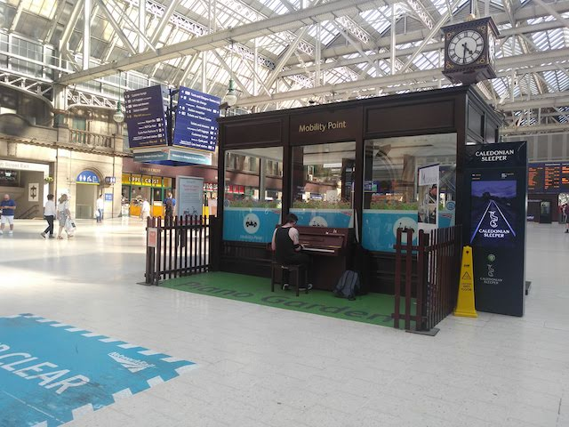

<!--0-->
# 再见，布里斯托
2019/11

一直想写一下UK之行，但每次心都沉静不下来。在深圳即便是周末，有大量的空闲时间也觉着单纯写游记是件挺浪费时间的事，这次趁着在老家休年假，心总算没有那么浮躁。只是距离上次UK之行时间间隔较远，我只能通过之前拍的图片整理一下记忆。

去程还算顺利。我记得深圳当天天气很糟糕，从深圳起飞的班机都取消了。为了不影响后续的航段，我只能将深圳到北京的航班改签为经广州起飞。飞机由广州起飞，到达北京，再由北京到慕尼黑中转，最后抵达格拉斯哥。UK之行一共三周：在格拉斯哥和爱丁堡各出差一周，最后一周是休年假自由行。
抵达格拉斯哥的时间是当地4月21日上午10点左右，虽然劳累，但当天并无睡意。在酒店办理完入住手续跟家人道过平安后，自己就外出逛街去了。格拉斯哥是我当时所接触到的第一座西方城市，到处洋溢着资本主义的气息（此处为褒义）。我只记得那天天空很蓝，空气很好，城市街道一尘不染，河边两侧是绿道。虽然时间已经接近中午，绿道上还是有跑步锻炼的人。绿道旁边的阶梯上，零散着几个人在晒太阳。

跟着谷歌地图导航，便来到了格拉斯哥中央火车站，里面有一座两层的酒屋，棕褐色，五六米开外看不出是实木建筑还是仿古涂层，我个人感觉是前者。有位旅客拎着行李想打包一杯啤酒，另一位双手交叉在胸前驻足，其他人慢悠悠走着路。虽然是火车车站，但人们好像都不怎么赶时间，几米外踱步的鸽子也不赶时间，它们也不怕人。大厅中央是Mobility Point, 两侧围起了栅栏，中间的地面被涂成了草绿色，中间是一架钢琴。一位纹身小哥坐在钢琴前正在演奏「权力的游戏」片头曲「Main Title」

未完待续...