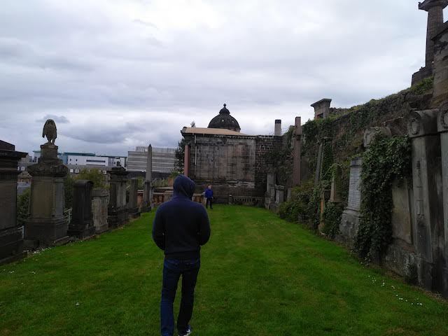
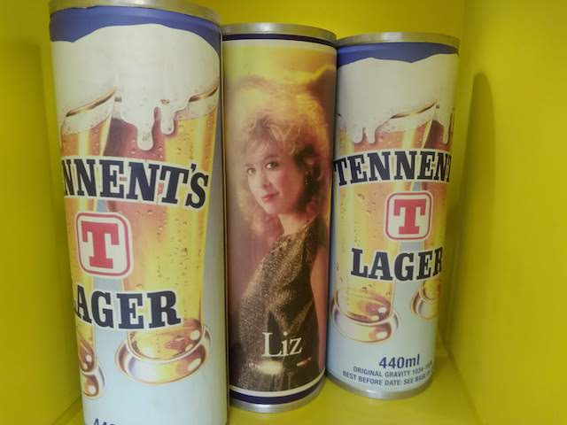
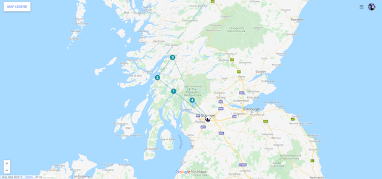

<!--0-->
# Hello，Scotland
2019/11

格拉斯哥的同事给人的感觉都很友好。在周二我见到了William，还有Gareth以及新加入的Ronnie，周二晚上William还带我去他家小酌了几杯，我还顺便撸了几把他家的猫。Renee周四晚上在给我一直推荐大英旅行线。从下午6点半一直介绍到晚上9点，两个半小时，非常热情。但是其实她应该不知道我还没有吃晚饭，肚子饿得咕咕响。Barry的妻子要在周五下午去面试新工作，她想把小女儿索菲亚让Barry带半天。于是中午左右，我见到了Barry的妻子，还有索菲亚。她半岁左右，还不会走路，但体重感觉早就超过我3岁的小外甥了。小家伙一点都不哭闹，见着陌生的面孔也不怕生，她总是笑，像个小天使。

周五下午时间是团建，爱丁堡的几个同事坐火车赶过来参加了下午的团建。活动说不上有趣，甚至有些硬核。午饭吃过后我们几个人便直接奔向了墓地The Necropolis，下午的团建活动是游墓地和参观啤酒厂Tennents Wellpark Brewery。为了让活动更有趣味性，William提议看谁找到年代最久远的墓碑。最终我记不得谁找到了年代最久的墓碑，只记得大家都比较冷，因为当天下午是小雨。

啤酒厂里有一个几层楼的展厅，介绍了发展史上的关键事件和人物。展厨里是历年酒瓶外包装，我最欢的是上世纪八九十年代的设计。自己童年就是那个年代，家里贴的海报就是港台女明星，跟欧美女性一个画风；另外因为我更偏爱那个年代的摇滚乐，也喜欢那时候的蒸汽复古迪斯科。

因为周日就要赶往爱丁堡办公室，周末相对自由的时间只有周六。我参考了Renee之前的推荐，直接购买了Rabbie服务，行程覆盖Oban，Glencoe，Highland Lochs & Castles。Oban和Loch Lomond留给我的印象最深刻，在Loch Lomond的某个瞬间甚至改变了我对家用车的认识。

