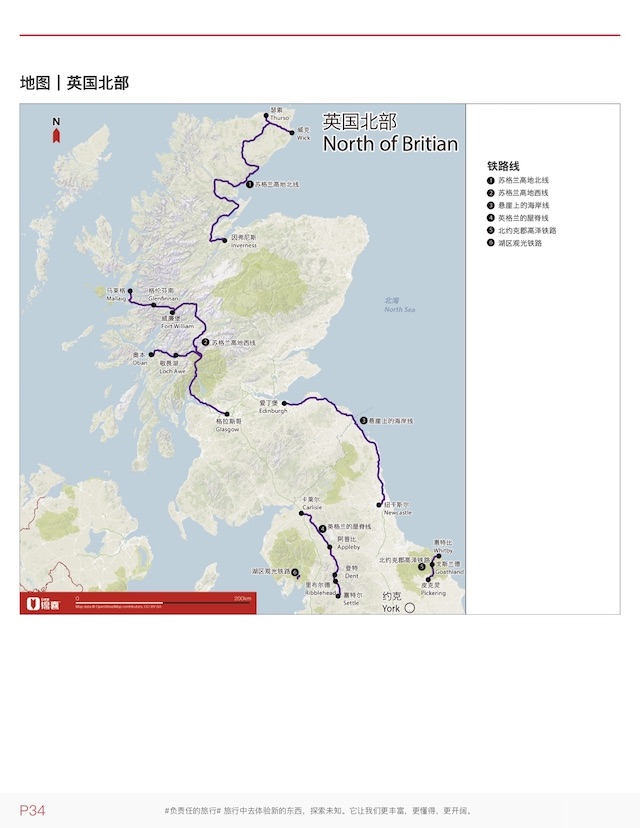
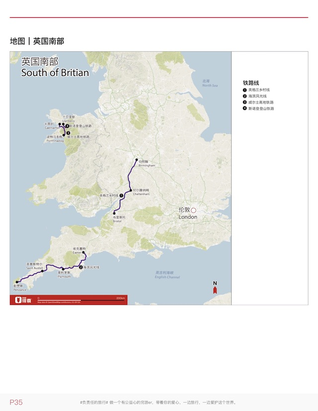

<!--0-->
2019/11

我不太喜欢爱丁堡这个城市，主要原因可能是格拉斯哥的先入为主。入乡随俗，中午基本上跟着本地的同事「混吃混喝」。但是这边的同事中午吃的很少，组内的几个同事午饭常见菜单是三明治和汤，午间休息是绕着公园散步。平时下班时间也正好赶上城堡的关闭时间，所以这周压根也没去成城堡。同事说我的签证可以去UK的任何地方，包括北爱尔兰，也就是在知道这个信息后，我把之前做的所有计划都取消了。事实证明，这是个明智的决定。

其实在来UK之前，我就大概做了行程规划，受影响最深的是穷游网作者赵小满的「UK RAILWAY 英国铁路」。见到这个穷游锦囊后的想法就是将自己的最后一周的大多数时间，都花在列车上。按照原来的计划，

